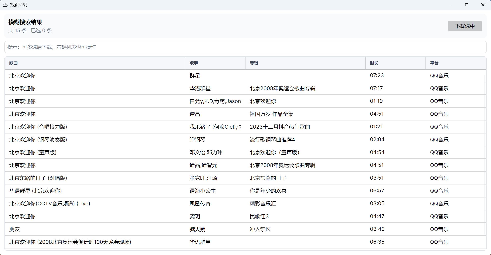

### How To Use

[👉163MusicLyrics User Guide](https://github.com/jitwxs/163MusicLyrics/wiki)

- [x] 支持网易云音乐、QQ音乐两家音乐提供商 Two providers: NetEase Cloud Music and QQ Music are supported
- [x] 支持单曲、专辑、歌单三种查询类别，ID 与链接精确查询 Support 3 search types: Song, Album, Playlist; search by ID or full URL for precise queries
- [x] 支持关键字模糊查询并提供结果选择窗口 Keyword-based fuzzy search with selectable result list
- [x] 支持批量查询与目录扫描批量导入 Support batch search and drive/folder scan input
- [x] 支持歌词结果保存与批量保存管理 Save lyrics results and manage batch saving
- [x] 支持自动获取并下载歌曲试听直链 Support retrieving and downloading preview song links
- [x] 支持歌曲直链在线播放与进度控制 In-app playback of preview links with progress control
- [x] 支持下载歌曲封面图片 Support downloading song cover images
- [x] 支持歌词格式转换（LRC <-> SRT）Built-in LRC <-> SRT format conversion
- [x] 支持多种歌词组织与渲染（原文/译文组合）Support multiple original/translated lyrics compositions
- [x] 支持百度翻译、彩云小译自动翻译歌词 Support Baidu Translate and CaiYun Translate APIs
- [x] 支持本地缓存（歌词与直链）Support local cache for lyrics and song links
- [x] 支持应用设置与主题切换 App settings with theme switching

### Downloads

进入 [GitHub Release](https://github.com/jitwxs/163MusicLyrics/releases)
页下载最新版本即可，您可点击 [ChangeLog](https://github.com/jitwxs/163MusicLyrics/wiki/ChangeLog) 查看不同版本的变更。

Enter the [Github Release](https://github.com/jitwxs/163musiclyrics/releses) page to download the latest version, you can
click on [Changelog](https://github.com/jitwxs/163musiclyrics/wiki/changelog) to view the changes in different versions.

  
  
  

### Contribution

您可访问 [163MusicLyrics Projects](https://github.com/users/jitwxs/projects/1) 了解项目当前阶段的工作计划，如您愿意在其中贡献力量，您可以：

- 将您的想法或发现的 bug 填写在 [issuses](https://github.com/jitwxs/163MusicLyrics/issues) 中，我将不定期的进行处理
- Fork 项目，并提交您的 pull requests

You can access [163MusiclyRics Projects](https://github.com/Users/jitwxs/projects/1) to learn about the current state of
the project, if you are willing to contribute, you can:

- Write feature suggestions or bug reports to [Issuses](https://github.com/jitwxs/163musiclyrics/issues), I will deal with it sometimes
- Fork the project, and submit your pull requests

### Stargazers over time

### Reference

本项目部分功能借鉴以下项目 Some features of this project took reference from other projects：

- https://github.com/Binaryify/NeteaseCloudMusicApi
- https://github.com/Rain120/qq-music-api
- https://github.com/jsososo/QQMusicApi
- https://github.com/ElliottSilence/LyricCapture
- https://github.com/xmcp/QRCD
- https://github.com/ivanakcheurov/ntextcat

第三方使用介绍视频 Third party use guide videos

- https://www.bilibili.com/video/BV19R4y197on

### Donate

如果本项目为您带来方便，欢迎 Star 来让更多人发现和使用它。本项目为个人维护项目，不收取任何费用，如果您愿意请作者喝杯咖啡话，欢迎打赏。

If this project brings you convenience, you're welcome to star it to let more people discover and use it. This project is
maintained personally, all features are free. If you would like to treat the creator with a bottle of coke, you're welcome to donate.

如您选择打赏，记得备注您的昵称，我将不定期为您登记到  [DONATE.md](./DONATE.md) 页面中。

If you choose to donate, remember to note your nickname, I will register it to  [DONATE.md](./DONATE.md) at free time.

    
    

最后，感谢 JetBrains 为开源项目提供免费的 IDE 支持。

Lastly, thanks to JetBrains for sponsoring the IDE for open-sources project.

